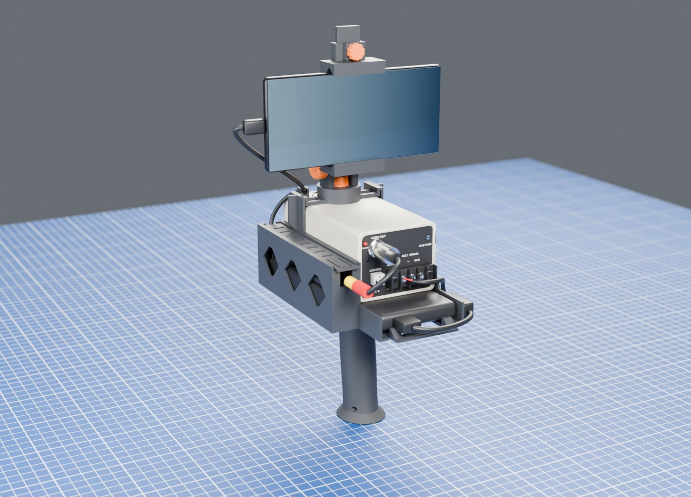
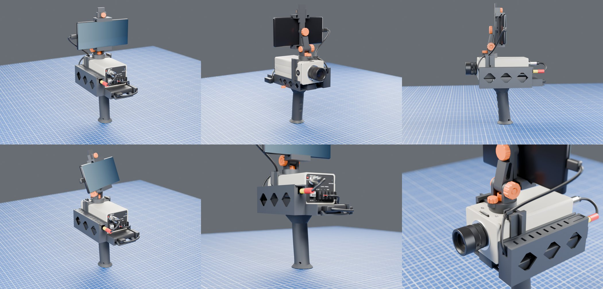
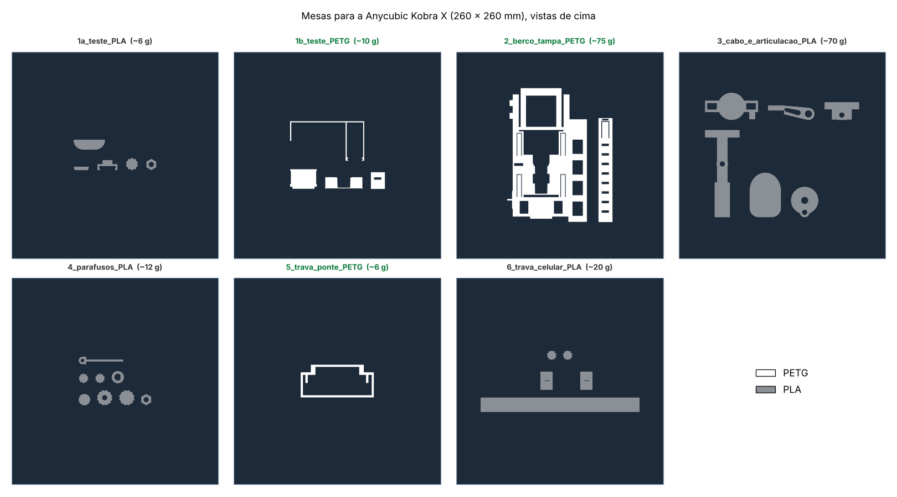
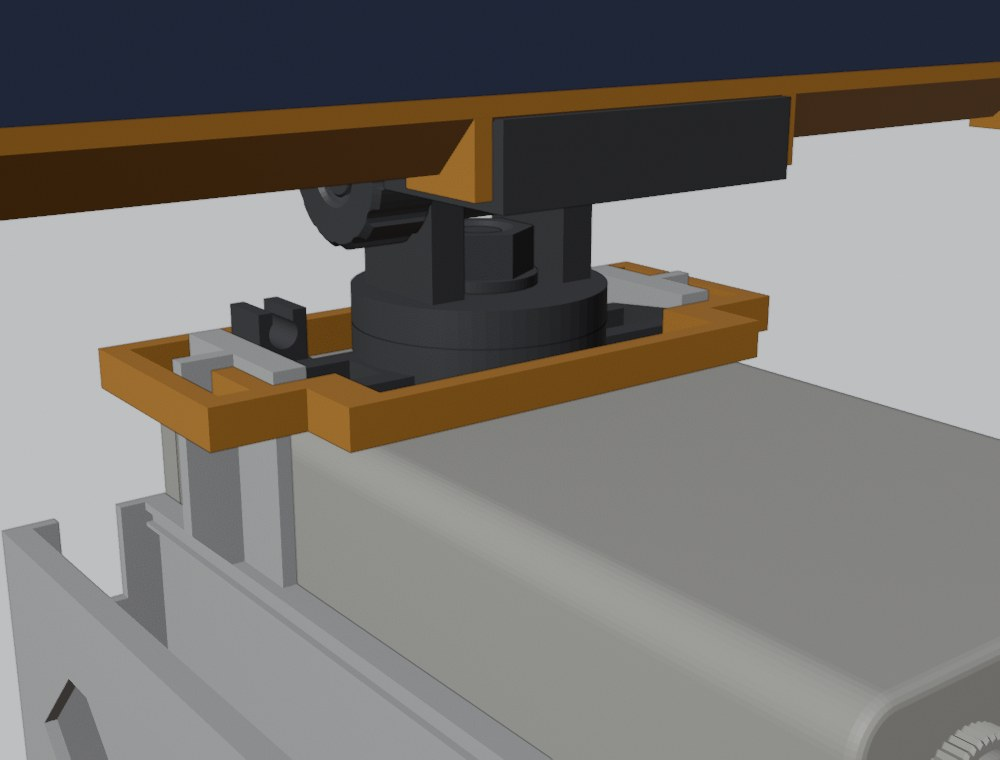
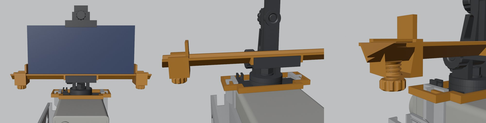

# Rig camcorder para a Sanyo VCC-4344

Este rig transforma uma câmera de CCTV analógica (Sanyo VCC-4344) numa filmadora de mão com cara de VHS. Ele é **100 % impresso em 3D**: não usa nenhum parafuso, porca ou peça de metal, e a câmera fica só encaixada, sem usar os parafusos dela.

<p align="center"><br><sub>Render do modelo. As travas extras aparecem nas imagens dos passos de montagem.</sub></p>

- **Câmera:** fica num berço que também guarda o power bank e a EasyCap.
- **Celular:** um Android serve de monitor e gravador. Ele fica numa articulação com giro, inclinação e rolagem.
- **Modelo paramétrico:** um único arquivo OpenSCAD (`scad/camcorder_rig_v6.scad`) gera todas as peças. As medidas da câmera, do power bank, da EasyCap, do celular e as folgas ficam no começo do arquivo.
- **Filamento:** ~180 g no rig completo (~80 g de PETG e ~100 g de PLA), mais ~16 g das peças de teste.

## Como cada parte prende

| Parte | Como prende |
|---|---|
| **Câmera** | Entra por trás no berço. O ferro (a chapa de suporte embaixo da câmera) corre sobre a sela, entre duas bochechas, até bater num batente. |
| **Ponte do topo** | Entra por trás, por baixo dos lábios das duas colunas. Os lábios descem para a frente, então a ponte funciona como cunha e aperta a câmera quando é empurrada. Uma moldura (trava da ponte) segura as colunas juntas. |
| **Power bank** | Molas no fundo do berço e uma trava traseira de encaixe. |
| **Cabo (empunhadura)** | Baioneta em rabo de andorinha: 2 garras sobem pelas janelas do berço e correm 13 mm para a frente. Uma chave trava. Veja [como o cabo prende](docs/img/como_o_cabo_prende.png). |
| **Giro, inclinação e rolagem** | Parafusos, porcas e botões impressos, com rosca de 8 mm e passo de 2 mm. A rosca é direita (aperta no sentido horário). |
| **Celular** | Garra com mordente que desliza e trava. A abertura (lado menor + espessura do celular) vai de ~68 a ~88 mm; o S21 dá 71,2 + 7,9 = 79,1 mm. Uma trava lateral com 2 cursores segura o celular nas pontas, para celulares de ~140 a ~172 mm de comprimento. Veja [como funciona](docs/img/como_funciona_trava_celular.png). |
| **EasyCap** | Caixa fechada do lado esquerdo do berço, com tampa deslizante e espaço para o adaptador OTG e as sobras de cabo. |

<p align="center"></p>

> **Lados:** "esquerdo" e "direito" são de quem segura o rig por trás, com a lente apontando para a frente. A caixa da EasyCap fica à esquerda e a chave do cabo entra pela direita.

## O que você precisa além das peças impressas

| Item | Observação |
|---|---|
| Câmera Sanyo VCC-4344 com lente CS | Medidas do modelo: corpo 67 × 126,5 × 54 mm. |
| Power bank | O modelo assume 124 × 67 × 13 mm. As molas absorvem ±1 mm na espessura. |
| Cabo USB 5 V → 12 V (step-up) | Alimenta a câmera pelo power bank. Prenda com 2 abraçadeiras ou barbante. |
| EasyCap (captura USB de vídeo AV) | O modelo assume 73 × 26 × 15,5 mm. **Nem toda EasyCap funciona no Android**: teste antes com um app de câmera USB. |
| Adaptador OTG (USB-A fêmea → USB-C) | Fica dentro da caixa. |
| Cabo BNC → RCA | Liga a saída de vídeo da câmera à EasyCap. |
| Celular Android | O modelo de referência é o Galaxy S21. No **iPhone** não funciona, porque o iOS não deixa apps usarem placas de captura USB. |
| EVA adesivo fino (opcional) | Dentro das mandíbulas da garra. |

## Peças

| Peça | Arquivo em `stl/` | Mesa (`mesas/`) | Qtd |
|---|---|---|---|
| Berço | `berco.stl` | 2 (PETG) | 1 |
| Tampa da caixa da EasyCap | `tampa.stl` | 2 (PETG) | 1 |
| Cabo | `cabo.stl` | 3 (PLA) | 1 |
| Ponte do topo (com o pino rosqueado do giro) | `topo.stl` | 3 (PLA)* | 1 |
| Garfo, braço, garra e mordente | `garfo.stl`, `braco.stl`, `garra.stl`, `mordente.stl` | 3 (PLA) | 1 de cada |
| Parafuso e porca-botão da inclinação, parafuso-botão da rolagem, parafusos de trava do giro e do mordente, porca e arruela em D do giro, chave do cabo | `parafusos.stl` | 4 (PLA) | 8 peças |
| Trava da ponte (moldura) | `trava_ponte.stl` | 5 (PETG) | 1 |
| Trava lateral do celular: calha, 2 cursores e 2 botões | `trava_celular.stl` | 6 (PLA) | 5 peças |
| Provas de encaixe | `testes_pla.stl`, `testes_petg.stl` | 1a / 1b | — |

\* A ponte fica apertada o tempo todo. Se ela ceder com o tempo, reimprima em PETG.

<p align="center"></p>

As configurações do fatiador estão em [docs/COMO_IMPRIMIR.md](docs/COMO_IMPRIMIR.md). Nenhuma peça precisa de suporte. As maiores são o berço (101 × 169 × 78 mm), a calha da trava do celular (200 mm de comprimento) e o cabo (105 mm de altura, impresso em pé).

## Antes de imprimir: provas e ajustes

Imprima as mesas **1a** (PLA) e **1b** (PETG) e confira cada prova. Se algo ficar justo ou folgado, mude o parâmetro no começo do `.scad`:

| Prova | Deve ficar | Parâmetro |
|---|---|---|
| Parafuso + porca | Entra só com os dedos, sem ficar bambo | `TH_CL` (folga da rosca, 0,3 mm) |
| Garra do cabo + canal da baioneta | Corre e aperta no fim do curso | `DV_CL` |
| Espinha + mordente | Desliza sem folga | `SP_CL` |
| Sela | O ferro da sua câmera entra entre as bochechas sem forçar | `BRK_UW` (largura do ferro, 21,6 mm) |
| Fatia do berço | A câmera e o power bank cabem com folga pequena | `CL`, `PB`, `CAM_W` |
| Pedaço da tampa | Corre nos trilhos da fatia | `LID_X0`, `LID_X1`, `GR_Z1` (folgas da tampa) |

Os `.3mf` não se atualizam sozinhos. Depois de mudar um parâmetro, gere o STL de novo e importe no fatiador:

```bash
openscad -D 'PART="berco"' -o stl/berco.stl scad/camcorder_rig_v6.scad
```

Os nomes de `PART` são: `topo`, `berco`, `tampa`, `cabo`, `garfo`, `braco`, `garra`, `mordente`, `parafusos`, `trava_ponte`, `trava_celular`, `testes_pla` e `testes_petg`. Com `PART="montagem"`, o arquivo mostra tudo montado.

## Montagem

Não precisa de ferramenta. Cada passo indica para que lado ele é feito.

1. **Cabo:**
   - Vire o berço de cabeça para baixo.
   - Encaixe as 2 garras do topo do cabo nas 2 janelas do fundo do berço, com o cabo uns 13 mm para trás.
   - Empurre o cabo para a frente até parar firme.
   - Enfie a chave pelo rasgo de baixo do lado **direito** até a argola encostar.
   - Para tirar: puxe a chave pela argola e empurre o cabo para trás.
2. **Câmera:**
   - Apoie a câmera no berço, atrás das colunas, com o ferro na altura da sela.
   - Deslize para a frente até o ferro bater no batente. A bucha do ferro corre num canal da sela.
3. **Power bank:**
   - Empurre por trás, com as portas para trás, até a trava estalar.
   - Para tirar: aperte a ponta da trava (a cauda com ranhuras) para baixo e puxe.
4. **Ponte do topo e trava da ponte:**
   - Apoie a ponte em cima da câmera, atrás das colunas, com o gancho para a frente.
   - Empurre a ponte para a frente, por baixo dos lábios, até ficar bem firme.
   - Encaixe a trava da ponte por cima, em volta das duas colunas e da base do giro. Isso tem que ser feito **antes** de colocar o garfo.

   
5. **Giro:**
   - Coloque o garfo no pino, a arruela com furo em D e a porca sextavada.
   - Aperte até o garfo girar firme.
   - Rosqueie o parafuso da trava do giro na orelha da frente do garfo.
6. **Inclinação:**
   - Ponha o braço entre as orelhas do garfo.
   - Passe o parafuso pela orelha **direita**, com a face plana para cima, encaixando no furo em D.
   - Rosqueie a porca-botão do lado esquerdo.
7. **Rolagem:** encoste a garra atrás do braço e passe o parafuso-botão pela frente do braço, rosqueando na garra.
8. **Trava do celular e celular:**
   - Enfie um cursor em cada ponta da calha, com os botões para baixo e as paredes viradas para o meio.
   - Rosqueie um botão em cada cursor.
   - Encaixe a calha no V da garra de baixo, com os dedos abraçando as pontas da garra.
   - Ponha o celular com o USB-C para a esquerda.
   - Encoste os cursores nas pontas do celular e aperte os botões.
   - Enfie o mordente pelo topo da espinha, desça até encostar no celular e aperte o botão do mordente com firmeza.

   
9. **EasyCap:**
   - Puxe a tampa da caixa pela ponta de trás, no rasgo para a unha.
   - Deite a EasyCap no fundo da caixa, com o USB para a frente, e encaixe o adaptador OTG.
   - Passe o cabo OTG pelo rasgo da frente e o RCA pelo rasgo de trás. As sobras de cabo ficam por cima.
   - Deslize a tampa por trás até clicar.

## Ligações

1. **Alimentação:**
   - Ligue o power bank ao cabo USB 5 V → 12 V e os fios aos bornes **DC 12V + e −** da câmera.
   - Prenda o step-up com abraçadeiras nas presilhas do lado direito do berço.
   - Confira a polaridade com multímetro antes de ligar. Não ligue nada nos bornes da entrada AC 24 V.
2. **Vídeo:** BNC "VIDEO OUT" → cabo BNC/RCA → RCA amarelo da EasyCap.
3. **Celular:**
   - Ligue o adaptador OTG ao celular passando pelo rasgo da frente e pelo gancho da ponte. Deixe uma folga perto da articulação.
   - No celular, use um app de câmera USB.

## Movimentos do celular

| Movimento | Faixa |
|---|---|
| Giro | 360° |
| Inclinação | −35° a +95° |
| Rolagem | ±30° |
| Inclinar para trás e rolar ao mesmo tempo | Com ±15° de rolagem, vai até −25°. Com ±30°, não incline para trás. |

## Verificações (`tools/`)

Os scripts conferem colisões entre todas as peças e a câmera (usando o modelo aproximado em `ref/`), varrem os movimentos do celular, calculam o centro de massa e estimam o filamento. Rode da raiz do repositório. Precisa de OpenSCAD 2021+ e Python 3 com os pacotes do `requirements.txt`.

```bash
pip install -r requirements.txt
bash tools/build6.sh asm_ topo berco tampa cabo chave porca trava_ponte garfo trava bincl braco garra brol mordente bmord trava_celular
python3 tools/check6.py          # colisões e movimentos
python3 tools/cog6.py            # centro de massa e estabilidade em pé
python3 tools/filamento.py stl/*.stl
```

**Resultado da v6:**
- **Colisões:** nenhuma entre as peças, nas faixas de movimento da tabela acima.
- **Equilíbrio:** o centro de massa fica a ~4 mm da mão.
- **Em pé:** o rig só tomba com mais de ~6° de inclinação.

## Glossário

- **Ferro:** a chapa de metal embaixo da câmera, onde normalmente vai a rosca de tripé.
- **Sela e bochechas:** o apoio do ferro no berço e as duas paredes que o guiam dos lados.
- **Lábios:** as abas no alto das colunas que seguram a ponte por cima.
- **Mordente:** a mandíbula de cima da garra do celular, que desliza na espinha.
- **OTG:** adaptador que deixa o celular usar um aparelho USB.
- **Step-up:** conversor que sobe os 5 V do power bank para os 12 V da câmera.
- **BNC:** o conector de vídeo da câmera.

## Histórico

- **v1–v4:** protótipos. Usavam os parafusos da câmera, uma luva e um pino impresso rosqueado no ferro, que quebrava.
- **v5:** berço sem os parafusos da câmera, caixa da EasyCap, garra ajustável e ~150 g de filamento. Ainda usava ferragens de metal.
- **v6 (atual):** 100 % impresso, com ponte em cunha, cabo em baioneta e roscas impressas. Depois do primeiro teste montado vieram a trava da ponte, a trava lateral ajustável do celular e parafusos de trava mais longos.

## Licença

© 2026 Rodrigo ([RodrigoFass](https://github.com/RodrigoFass)).

- **Peças, modelos e documentação** (`scad/`, `stl/`, `mesas/`, `docs/`, `ref/`): [CC BY-SA 4.0](LICENSE-HARDWARE.txt). Você pode usar, modificar e vender, desde que dê o crédito e compartilhe as modificações com a mesma licença.
- **Scripts** (`tools/`): [MIT](tools/LICENSE).
