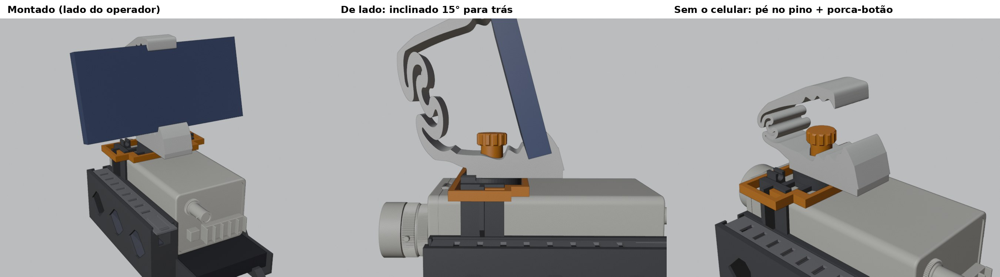
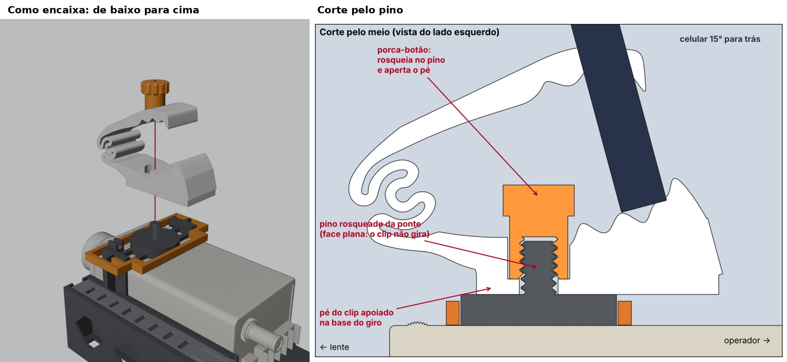

# Suporte fixo do celular (clip do MakerWorld)

Esta opção troca a articulação (giro, inclinação e rolagem) por um suporte fixo. O celular fica num clip de mola preso na base do giro da ponte, com a tela para o operador e inclinado 15° para trás, com a tela apontando um pouco para cima.





O clip é o [Ultimate Desk & Cockpit Phone Holder Clip v3](https://makerworld.com/models/1158094), de **RealNationPrint**, impresso a 110 %, como no perfil do autor.
- **A garra de cima, com a mola em espiral,** segura o celular deitado pela altura. O fundo do celular fica nos dentes, atrás do lábio da frente, e a ponta da garra prende o topo.
- **A garra de baixo,** que prendia o clip no painel do carro, foi tirada.
- **No lugar dela entra um pé,** com furo em D que encaixa no pino do giro. A face plana do pino impede o clip de girar.
- **Uma porca-botão** rosqueia no pino por cima e aperta o pé contra a base.
- **Inclinação:** o corpo do clip é inclinado 15° em cima do pé, que continua reto na base. Para mudar, altere `CL_INC` no `.scad`.

## O arquivo do clip não vem neste projeto

A licença do autor (Standard Digital File License) não permite redistribuir o modelo nem versões modificadas dele. Por isso o perfil do clip não está no repositório. Para gerar o clip adaptado:

1. Baixe o `.3mf` do clip na página do MakerWorld.
2. Na raiz do repositório, rode:
   ```
   python3 tools/clip_perfil.py ClipV3.3mf
   ```
   Isso grava `scad/clip_v3_perfil.scad`, que fica fora do git.
3. Gere as peças:
   ```
   openscad -D 'PART="clip"' -o clip.stl scad/camcorder_rig_v6.scad
   openscad -D 'PART="porca_clip"' -o porca_clip.stl scad/camcorder_rig_v6.scad
   ```

O arquivo gerado é só para uso pessoal.

## Impressão

| Peça | Material | Configuração | Filamento* |
|---|---|---|---|
| Clip (`PART="clip"`) | **PETG** | Deitado, com o perfil na mesa. Camada de 0,2 mm, 3 paredes, 25 % de preenchimento, sem suporte. | ~30 g |
| Porca-botão (`PART="porca_clip"`) | PLA | Botão na mesa. Mesma configuração das porcas (mesa 4): camada de 0,12 mm, 5 paredes, 40 %. | ~3 g |

\* Estimativa. O fatiador mostra o peso exato.

- **Por que PETG no clip:** a mola em espiral flexiona muito para o celular entrar. Em PLA ela pode trincar.
- **Furos sem suporte:** o furo em D sai com o teto reto e o rebaixo da porca sai em gota.

## Montagem

1. **Peças da articulação:** tire o garfo e tudo o que fica nele: braço, garra, mordente, os parafusos e a porca sextavada do giro com a arruela.
   - A ponte, a trava da ponte (moldura) e o resto do rig ficam como estão.
2. **Clip:**
   - Encaixe o pé do clip no pino do giro, com a mola em espiral para a frente (lado da lente) e os dentes para trás.
   - O furo em D só entra numa posição.
3. **Porca-botão:**
   - Coloque a porca-botão no pino por cima do corpo do clip.
   - Aperte com os dedos, no sentido horário, até o pé ficar firme.
4. **Celular:**
   - Levante a garra de cima.
   - Apoie o celular nos dentes, com a tela para trás e encostado no lábio.
   - Solte a garra sobre o topo do celular.
   - Deixe o USB-C para a esquerda, do lado da EasyCap.

**Opcional:** EVA fino adesivo nos dentes, para o celular não escorregar para os lados.

## Conferido no computador

- **Interferências:** o clip não bate na câmera nem na trava da ponte. Ficam 7 mm até o topo da câmera e 1,5 mm até a moldura.
- **Folgas:**
  - furo em D no pino: 0,2 mm;
  - porca-botão no rebaixo: 0,4 mm;
  - botão até o corpo do clip: 2,3 mm.
- **Celular:**
  - Fica inclinado 15° para trás, de Z 52 a 126 mm, uns 6 mm mais baixo que na articulação.
  - Sobram 8 mm entre o celular e a porca-botão.
- **Equilíbrio:** o centro de massa fica ~1,5 mm atrás da mão. Antes ficava ~4 mm.
- **Em pé na mesa:** o rig só tomba se inclinar mais de ~6°.

Para refazer as contas: `tools/check_clip.py` e `tools/cog_clip.py`.
